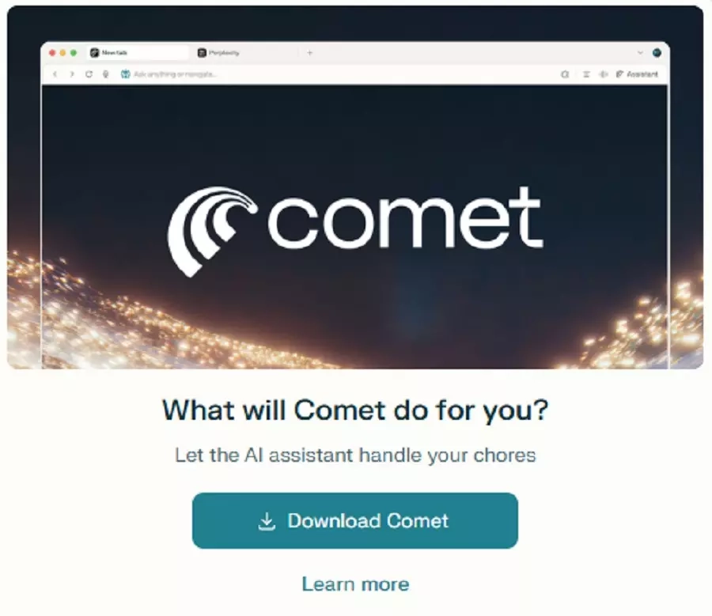

# Perplexity推出免费Comet浏览器：AI搜索直接内置到浏览器里了

---

你是不是也觉得，每次搜索都要先打开浏览器、再打开搜索引擎、然后还要在一堆广告和SEO垃圾里找答案，这个流程有点蠢?Perplexity显然也这么想。他们刚刚把自家的AI搜索引擎直接塞进了浏览器里,而且现在全球免费下载。对于那些想要更快获取信息、又不想被传统搜索引擎牵着鼻子走的人来说,这可能是个值得一试的选择。

---

## 从付费到免费:Comet浏览器的转变

Perplexity的Comet浏览器最早在去年7月上线,但那时候只对每月付200美元的Max订阅用户开放。说实话,这个定价让大部分人直接劝退了。

现在情况变了。Perplexity宣布Comet浏览器全球免费下载,不需要订阅,不需要付费,直接用。

这个转变挺有意思的。一方面,免费策略能快速扩大用户基数;另一方面,也说明Perplexity可能找到了其他变现方式,不再指望靠浏览器本身赚钱。

## Comet浏览器到底有什么不同?

传统浏览器的逻辑是:你打开浏览器→输入网址或搜索→点击结果→浏览网页。

Comet的逻辑是:你打开浏览器→直接问问题→AI给你答案。

听起来差不多?其实区别挺大的。

传统搜索引擎给你的是一堆链接,你需要自己点进去、阅读、筛选、对比。Perplexity的AI搜索直接给你整理好的答案,还会标注信息来源。这种方式更适合那些"我就想快速知道答案"的场景。

当然,如果你喜欢自己慢慢翻网页、享受探索的过程,那传统浏览器可能更适合你。但如果你只是想快速解决问题,👉 [Perplexity的这种AI搜索方式确实更高效](https://pplx.ai/ixkwood69619635)。

## Comet Plus:付费订阅还是存在的

虽然Comet浏览器本身免费了,但Perplexity在8月推出了一个叫Comet Plus的订阅服务。

这个服务的卖点是:你可以访问"可信"媒体的内容,比如《洛杉矶时报》和《世界报》。Perplexity还会和这些媒体分成。

这个模式挺聪明的。一方面,它解决了AI搜索引擎长期以来的版权争议问题;另一方面,也给了用户一个付费的理由——如果你需要更权威、更深度的信息,那就订阅Comet Plus。

但说实话,对于大部分普通用户来说,免费版可能就够用了。

## AI浏览器的竞争:Perplexity vs Meta

说到AI浏览器,不得不提一下Meta。

就在几周前,扎克伯格在Meta Connect大会上演示了Meta的最新AI功能,结果现场翻车了。演示过程磕磕绊绊,AI的表现也不尽如人意。

这对Perplexity来说是个好消息。毕竟,当行业老大都在犯错的时候,小公司反而有机会脱颖而出。

Perplexity的优势在于专注。他们不像Meta那样什么都想做,而是把精力集中在AI搜索这一件事上。这种专注让他们在产品体验上做得更细致。

## Background Assistant:移动端的新功能

Perplexity还预告了Comet移动应用的新功能,叫做Background Assistant(后台助手)。

虽然具体细节还没公布,但从名字来看,这个功能可能会在后台持续运行,帮你处理一些信息收集和整理的工作。

比如,你可能在通勤路上看到一条新闻,想深入了解,但又没时间。Background Assistant可能会自动帮你收集相关信息,等你有空的时候再查看。

这种"主动式"的信息服务,可能是AI浏览器的下一个方向。

## 谁适合用Comet浏览器?

说了这么多,Comet浏览器到底适合谁用?

**适合的人:**
- 经常需要快速查找信息的人(学生、研究人员、内容创作者)
- 不喜欢在搜索结果里翻来翻去的人
- 想尝试AI搜索但不想付费的人

**可能不适合的人:**
- 喜欢自己慢慢浏览网页的人
- 对AI生成内容持怀疑态度的人
- 已经习惯了Chrome或Safari生态的人

总的来说,Comet浏览器更像是一个"效率工具",而不是传统意义上的浏览器。如果你的需求是"快速获取答案",那它可能很适合你;如果你的需求是"享受浏览过程",那传统浏览器可能更好。

## 怎么下载Comet浏览器?

如果你想试试Comet浏览器,可以直接去Perplexity AI的官网下载。

目前支持的平台包括桌面端和移动端,具体支持哪些操作系统,官网上会有详细说明。

下载和安装过程应该很简单,和其他浏览器没什么区别。

---

## 结语

Perplexity把Comet浏览器免费开放,这一步走得挺大胆。对于那些想要更高效获取信息、又不想被传统搜索引擎牵着鼻子走的人来说,这是个值得尝试的选择。当然,AI搜索还在发展阶段,不可能完美,但至少👉 [Perplexity在"让搜索更简单"这件事上,确实走在了前面](https://pplx.ai/ixkwood69619635)。如果你也厌倦了在一堆搜索结果里翻来翻去,不妨试试Comet浏览器,看看AI搜索能不能真的提高你的效率。
